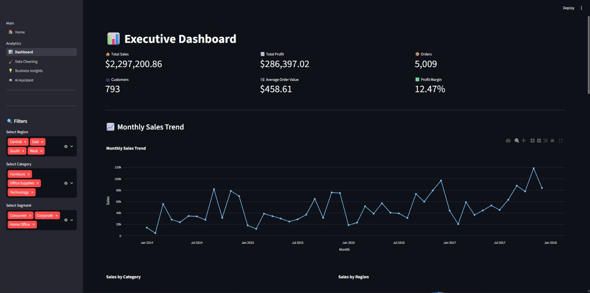
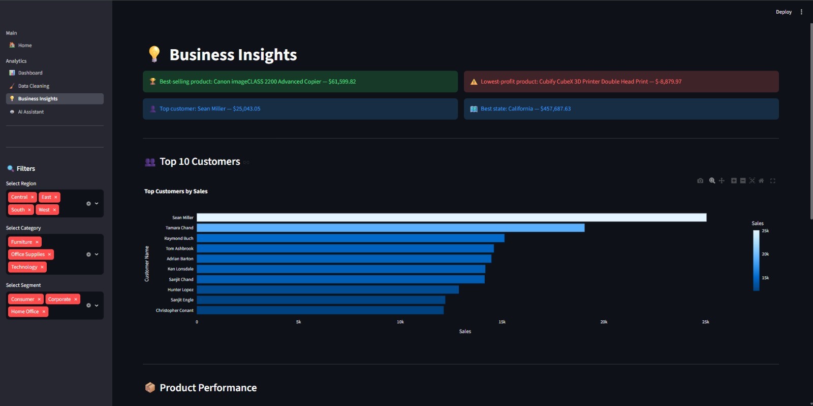
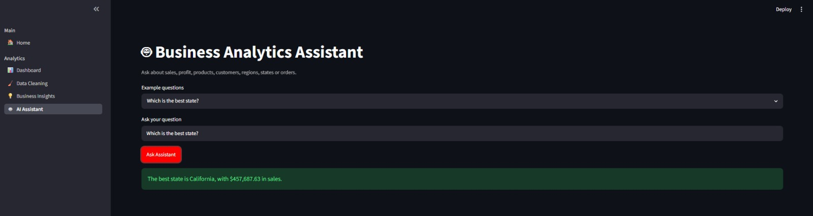
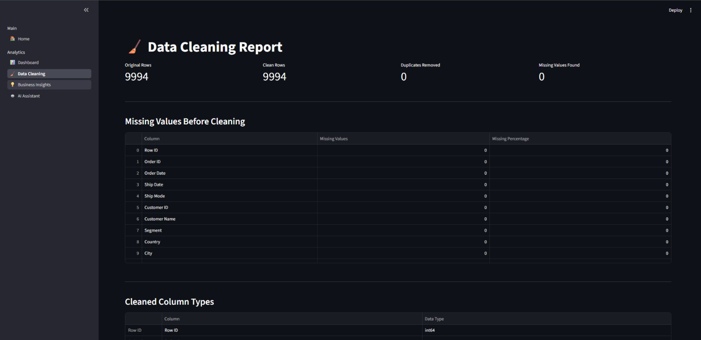
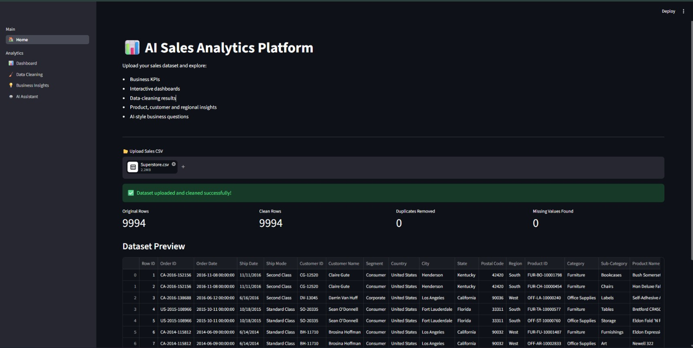

# 📊 AI-Powered Sales Analytics Platform


A production-style, multi-page business analytics application that transforms raw sales data into interactive dashboards, business KPIs, data-quality reports and actionable insights.

The platform allows users to upload a CSV dataset, automatically clean it, filter the results and explore sales performance through an intuitive Streamlit interface.

## 🚀 Live Application

[Launch the Sales Analytics Platform](YOUR_STREAMLIT_APP_URL)

## 📸 Dashboard Preview



## ✨ Key Features

- Upload and process CSV sales datasets
- Validate required dataset columns
- Automatically remove duplicate records
- Handle missing numeric and text values
- Convert sales, profit and date columns safely
- Apply interactive region, category and segment filters
- Calculate key business performance indicators
- Analyze monthly sales trends
- Compare category and regional performance
- Identify top-selling and unprofitable products
- Analyze top customers and high-performing states
- Ask predefined natural-language business questions
- Download the cleaned dataset
- Navigate through a responsive multi-page interface

## 📊 Business KPIs

The executive dashboard calculates:

- Total sales
- Total profit
- Total orders
- Unique customers
- Average order value
- Overall profit margin

## 🖼️ Application Pages

### Executive Dashboard

Interactive KPI cards, filters, monthly sales trends and category and regional visualizations.


### Business Insights

Highlights top products, low-profit products, valuable customers, regional performance and business recommendations.



### Analytics Assistant

A deterministic natural-language assistant that answers common questions about sales, profit, customers, products, regions and orders.



### Data Cleaning Report

Displays original and cleaned row counts, duplicate records, missing values, column types and the cleaned dataset.



### Dataset Upload

Users can upload a compatible CSV file and preview the processed data before opening the analytics pages.



## 🔍 Example Business Questions

The analytics assistant can answer questions such as:

- What are the total sales?
- What is the total profit?
- Which product made the highest profit?
- Which product generated the highest sales?
- Who is the top customer?
- Which region has the highest sales?
- Which state performs best?
- What is the overall profit margin?
- How many unique orders are there?

## 🛠️ Technology Stack

| Area | Technology |
|---|---|
| Programming | Python |
| Web application | Streamlit |
| Data processing | Pandas |
| Data visualization | Plotly |
| Version control | Git and GitHub |
| Deployment | Streamlit Community Cloud |

## 🏗️ Application Workflow

```text
Upload CSV
    ↓
Validate Required Columns
    ↓
Remove Duplicates and Handle Missing Values
    ↓
Store Cleaned Data in Session State
    ↓
Apply Interactive Filters
    ↓
Generate KPIs, Charts and Business Insights
    ↓
Download Cleaned Dataset
```

## 📁 Project Structure

```text
ai-sales-analytics-dashboard/
│
├── app.py
├── utils.py
├── requirements.txt
├── README.md
├── .gitignore
│
├── pages/
│   ├── Dashboard.py
│   ├── Data_cleaning.py
│   ├── Business_Insights.py
│   └── AI_Assistant.py
│
├── assets/
│   ├── dashboard-overview.png
│   ├── business-insights.png
│   ├── ai-assistant.png
│   ├── data-cleaning.png
│   └── upload-page.png
│
└── data/
    └── Superstore.csv
```

## 📋 Required Dataset Columns

The uploaded CSV file must contain these columns:

| Column | Description |
|---|---|
| Order ID | Unique order identifier |
| Order Date | Date when the order was placed |
| Customer Name | Customer associated with the order |
| Segment | Customer segment |
| Region | Sales region |
| State | Customer or order state |
| Category | Main product category |
| Sub-Category | Product sub-category |
| Product Name | Name of the product |
| Sales | Revenue generated by the order |
| Profit | Profit generated by the order |

Additional columns are supported and retained in the cleaned dataset.

## 💻 Run Locally

### 1. Clone the repository

```bash
git clone https://github.com/YOUR_GITHUB_USERNAME/ai-sales-analytics-dashboard.git
cd ai-sales-analytics-dashboard
```

### 2. Create a virtual environment

```bash
python -m venv venv
```

### 3. Activate the environment

Windows:

```bash
venv\Scripts\activate
```

macOS or Linux:

```bash
source venv/bin/activate
```

### 4. Install dependencies

```bash
pip install -r requirements.txt
```

### 5. Start the application

```bash
streamlit run app.py
```

Open the local URL displayed in the terminal, usually:

```text
http://localhost:8501
```

## 📦 Dependencies

```text
streamlit>=1.36
pandas>=2.0
plotly>=5.20
```

## ☁️ Deployment

The application is deployed using Streamlit Community Cloud.

To deploy your own version:

1. Fork or clone this repository.
2. Push the project to a public GitHub repository.
3. Sign in to Streamlit Community Cloud.
4. Select the repository and `main` branch.
5. Set the application entry point to `app.py`.
6. Click **Deploy**.

## 🧠 Skills Demonstrated

- Exploratory data analysis
- Data cleaning and validation
- Business KPI development
- Interactive data visualization
- Customer and product analysis
- Python application development
- Multi-page Streamlit architecture
- Session-state management
- Git and GitHub workflows
- Cloud application deployment

## 🔮 Planned Improvements

- Time-series sales forecasting
- OpenAI or Gemini integration
- PDF business report generation
- Excel file support
- PostgreSQL database integration
- User authentication
- Saved dashboard configurations
- Docker containerization
- Automated testing and CI/CD

## 👤 Author

**Kaustubh Valanjuwani**

- GitHub: [YOUR_GITHUB_USERNAME](https://github.com/YOUR_GITHUB_USERNAME)
- LinkedIn: [Connect with me](YOUR_LINKEDIN_PROFILE_URL)
- Live project: [AI Sales Analytics Platform](YOUR_STREAMLIT_APP_URL)

## ⭐ Support

If you found this project useful, consider giving the repository a star.